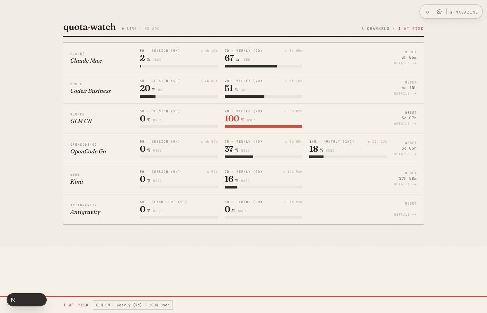

<div align="center">

# quota·watch

**English** · [简体中文](README.zh-CN.md)

**Local-first quota monitoring for your AI coding subscriptions.**

See how much of each plan you've burned — and how long until it resets — across
Claude Code, Codex, GLM, OpenCode Go, Kimi, Antigravity and more.
In your browser, and in your agent harness over MCP.
No cloud, no telemetry — your tokens never leave your machine.

[](LICENSE)




</div>

---

## Why

If you juggle several AI coding subscriptions, you know the moment: mid-flow, a
plan silently caps out and everything stalls. **quota-watch** polls each
provider's real quota API in near-realtime, normalizes them into one model, and
shows you — everywhere you look — exactly how much is left and when it resets.

## Highlights

- 🛰 **11 providers, natively integrated** — Claude Code, Codex (your ChatGPT plan's Codex quota), GLM, OpenCode Go, Kimi, Antigravity, Grok, plus pay-as-you-go balances from DeepSeek, OpenRouter, AIHubMix and OrcaRouter. Direct HTTP clients; no shelling out to community tools. GitHub Copilot is on the roadmap.
- ⚡ **Near-realtime** — ~10 s when usage is moving, backing off when idle. GLM tips over its cap and you see it in seconds, not half an hour.
- 🧭 **One unified model** — every quota window carries a *kind* (session · day · week · month · balance), so `5h`, `7d` and `1mo` always read the same order across every surface.
- 🔀 **Per-provider on/off switch** — pause a subscription and it stops polling *and* disappears from the dashboard; resume it any time from the setup page.
- 🎨 **A single Magazine dashboard** — editorial broadsheet layout; one deliberate design, no theme switcher.
- 🤖 **MCP server** — agents query quota state and get headroom-ranked channel recommendations over stdio or HTTPS.
- 🔒 **Local-first & private** — SQLite on your machine; credentials are used only to call each provider's own API and are never uploaded anywhere.

## The web dashboard — Magazine

One deliberate editorial design: broadsheet typography, ink-band gauges, drawer detail view.


## Quick start

```bash
pnpm install
pnpm build

# 1. connect providers (web setup page — supports credential auto-detect):
cd packages/web && npx next start -p 3000   # open http://localhost:3000/setup
#    ...or from the CLI:
node packages/cli/dist/index.js config add claude

# 2. start the polling daemon (embedded API on 127.0.0.1:3737)
node packages/cli/dist/index.js daemon start

# 3. watch
open http://localhost:3000
```

## Commands

| Command | Description |
|---|---|
| `quota-watch status [--json]` | Quick quota overview |
| `quota-watch dashboard` | Interactive TUI |
| `quota-watch config add/list/test/remove <provider>` | Manage providers |
| `quota-watch daemon start [--lan]` | Background polling + API (`--lan` binds `0.0.0.0` with token auth, for LAN/tunnel access) |
| `quota-watch mcp` | MCP server on stdio — let an agent harness read quota state |

## MCP (for agent dispatch)

For agent harnesses, `quota-watch mcp` serves two MCP tools over stdio:

| Tool | What it answers |
|---|---|
| `get_quota_overview` | All channels: windows, remaining %, resets, burn predictions, last-poll freshness |
| `recommend_channel` | Headroom-ranked channel list for dispatching a task (staleness- and error-aware) |

Register it with your harness, e.g. Claude Code:

```bash
claude mcp add quota-watch -- node "$PWD/packages/cli/dist/index.js" mcp
```

**Remote machines** use the same two
tools over streamable HTTP: the daemon also serves MCP at `/mcp` on its HTTPS
API, gated by the same Bearer token — so through the frp tunnel any server can
reach it. Its TLS cert only lists 127.0.0.1 by default; to add the tunnel's
public IP set `QUOTA_WATCH_CERT_EXTRA_SANS="IP:<public-ip>"` in the daemon's
environment before first cert generation (the macOS launchd template already
does), delete `~/.quota-watch/certs/server.{crt,key}`, and restart. The CA —
and every device's pin — is unaffected. On the remote machine:

```bash
# trust ONLY this CA for node (additive — doesn't touch system roots)
mkdir -p ~/.quota-watch && scp mac:~/.quota-watch/certs/ca.crt ~/.quota-watch/
echo 'export NODE_EXTRA_CA_CERTS="$HOME/.quota-watch/ca.crt"' >> ~/.shell_env
claude mcp add quota-watch --transport http https://<public-ip>:3737/mcp \
  --header "Authorization: Bearer <api token from ~/.quota-watch/config.json>"
```

## Run at login & public access (macOS)

Register the daemon, web dashboard and an optional [frp](https://github.com/fatedier/frp)
tunnel as launchd agents so they start at login and restart on crash:

```bash
./deploy/mac/install-services.sh            # daemon (:3737) + web (:3000)
# public access via your own cloud frps server:
cp deploy/mac/frpc.toml.example ~/.quota-watch/frpc.toml   # fill server + token
./deploy/mac/install-services.sh            # now also installs the frpc tunnel
```

See [`deploy/mac/README.md`](deploy/mac/README.md) for the full setup and
security notes.

## Supported providers

| Provider | Windows | Credentials |
|---|---|---|
| Claude Code | 5h session, 7d weekly (+sonnet) | reuses `~/.claude/.credentials.json`, auto-refresh |
| Codex | 5h session, 7d weekly | reuses `~/.codex/auth.json` — your **ChatGPT** login; surfaces your ChatGPT plan's (Plus/Pro) Codex quota, auto-refresh |
| GLM-CN | 5h session, 7d weekly | Coding Plan API key |
| OpenCode Go | 5h session, 7d weekly, 1mo monthly | opencode.ai `auth` cookie + workspace id |
| Kimi | 5h session, 7d weekly | Kimi Code API key |
| Antigravity | 5h + weekly Gemini pool, 5h + weekly Claude+GPT pool | LOCAL first: reads the running IDE's language server (Connect RPC, no credentials) via `RetrieveUserQuotaSummary` — the same data the IDE's own quota UI shows; falls back to the `antigravity-usage` CLI token store (5h only) |
| Grok | monthly credits | reuses the xAI OAuth store shared by `grok login` / cliproxyapi (`~/.cli-proxy-api/xai-*.json`), auto-refresh |
| DeepSeek | account balance (CNY/USD) | pay-as-you-go API key; read live from `$DEEPSEEK_API_KEY` in `~/.shell_env` each poll (DB value is fallback) |
| OpenRouter | lifetime credits vs usage | pay-as-you-go API key; read live from `$OPENROUTER_API_KEY` in `~/.shell_env` each poll (DB value is fallback) |
| AIHubMix | account balance (USD) | Manage Key (系统访问令牌) from console.aihubmix.com → settings — the sk- inference key cannot read balances |
| OrcaRouter | account balance (USD) + model-scoped free credit | pay-as-you-go API key; read live from `$ORC_ROUTER_API_KEY` in `~/.shell_env` each poll (DB value is fallback) |

*Roadmap:* a **GitHub Copilot** adapter (monthly request allowances) is implemented but its credential setup isn't wired into the app yet.

OpenCode Go window semantics (server-defined): 5h is a true rolling window;
**weekly resets Monday 00:00 UTC**; **monthly resets on your billing-cycle
timestamp**, not the calendar month.

## Architecture

```
quota-watch/
├── packages/core/    unified quota model (window kinds) + providers + scheduler
│                     + daemon HTTPS API + CLI-credential reuse/refresh
├── packages/cli/     status · config · dashboard · daemon · mcp (stdio server)
├── packages/web/     Next.js dashboard — single Magazine layout, :3000
└── deploy/mac/       launchd agents: daemon + web (+ optional frp tunnel)
```

The daemon is the hub: it polls providers, persists snapshots to SQLite, and serves
one HTTPS API (`/health`, `/quota`, `/poll`, `/mcp`). The web dashboard and MCP
clients are views of it.

## Configuration

`~/.quota-watch/config.json` (created on demand):

```json
{
  "poll": { "fastMs": 10000, "baseMs": 15000, "idleMs": 60000 },
  "api":  { "host": "127.0.0.1", "port": 3737, "token": null }
}
```

The daemon API needs no auth for loopback clients; non-loopback (LAN/public) clients
must send `Authorization: Bearer <api.token>`, auto-generated by `daemon start --lan`.

## Privacy

- **Claude / Codex / Antigravity** reuse the tokens their official CLIs already
  stored on disk — nothing to paste, refreshed in place.
- Credentials you provide (GLM / Kimi / OpenCode Go) are written only to
  `~/.quota-watch/data.db` (mode 600).
- Credentials stay local, are used only to call each provider's own quota API,
  and are never uploaded. The web UI only ever receives credential field *names*.

## License

[MIT](LICENSE)
