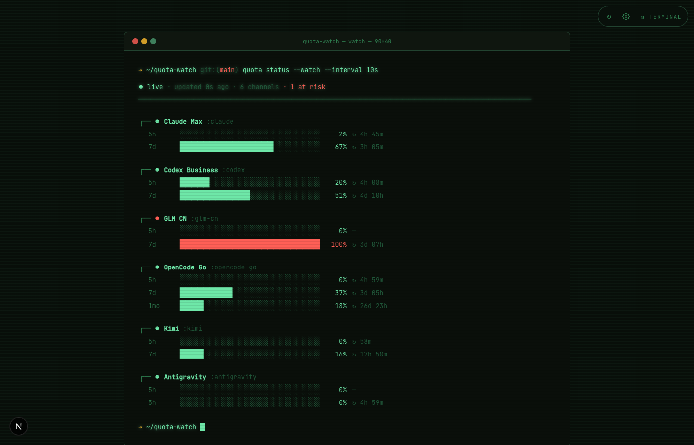
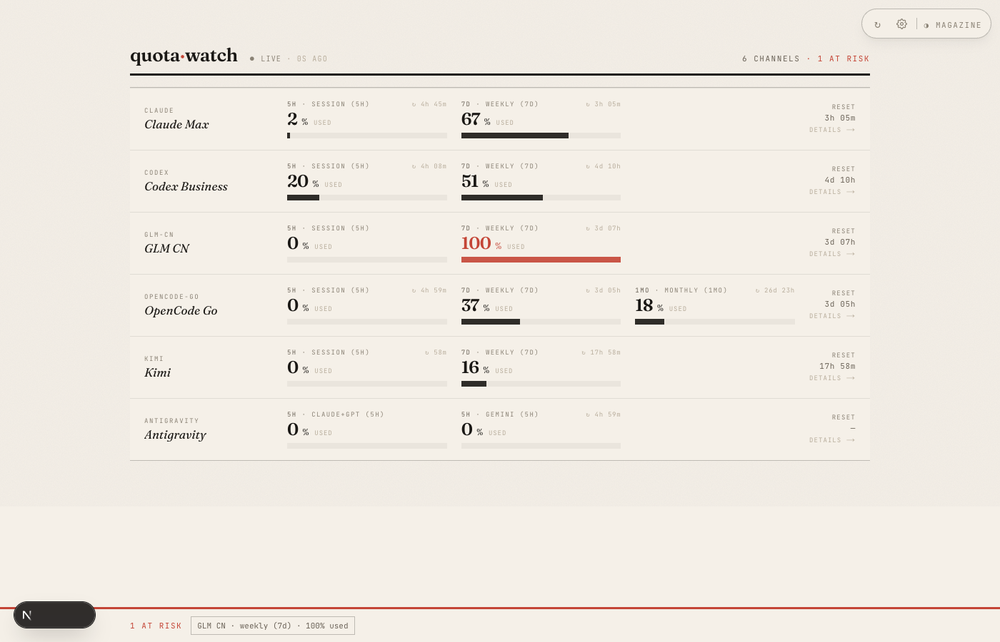
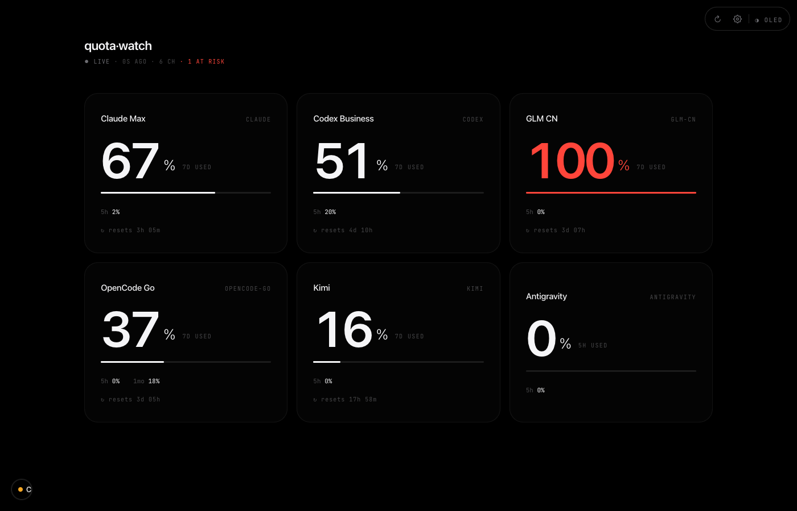
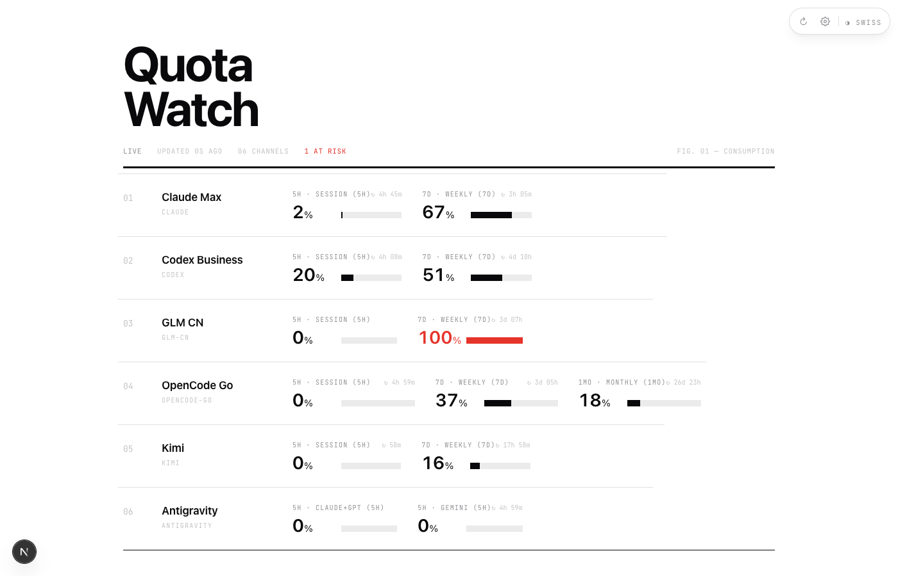
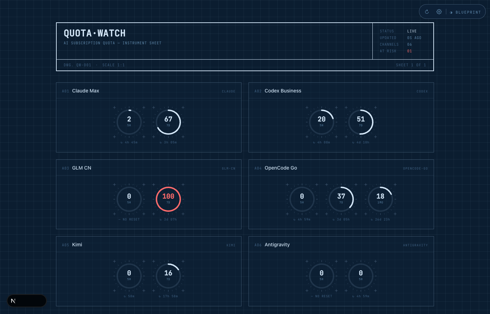
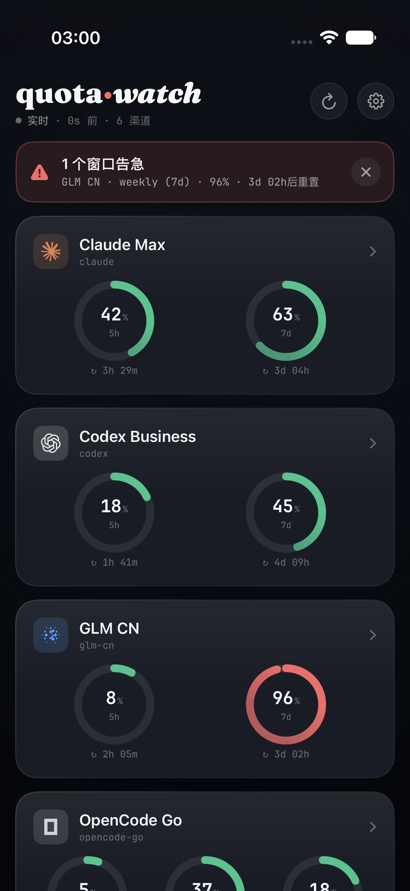

<div align="center">

# quota·watch

[English](README.md) · **简体中文**

**本地优先的 AI 订阅配额监控。**

一屏盯住 Claude Code、Codex、GLM、OpenCode Go、Kimi、Antigravity 等所有 AI 订阅
还剩多少额度、多久重置。桌面、菜单栏、iPhone 三端同看。
无云端、无遥测——你的凭据永远不离开本机。

[](LICENSE)




</div>

---

## 为什么

同时开着好几个 AI 编程订阅的人都懂那一刻:写到一半,某个套餐悄无声息地到顶,一切
卡住。**quota-watch** 近实时地轮询每家的真实配额接口,归一成同一个模型,在你会看的
每个地方告诉你:还剩多少、几时重置。

## 亮点

- 🛰 **8 家原生集成** —— Claude Code、Codex、GLM、OpenCode Go、Kimi、Antigravity、GitHub Copilot、Gemini CLI。直连各家 HTTP 接口,不 shell-out 到社区工具。
- ⚡ **近实时** —— 用量变动时约 10 秒刷新,空闲时自动降频。GLM 一超配额你几秒就看到,不是等半小时。
- 🧭 **统一模型** —— 每个配额窗口带「类型」(session · day · week · month),`5h`/`7d`/`1mo` 在每个端都按同一顺序呈现。
- 🎨 **五套网页仪表盘,五种布局** —— 不是换配色。每个主题是独立的排版、可视化与动效(见下)。
- 📱 **iOS app** —— 深色仪表界面、真实厂商图标、环形量表;经局域网或隧道连你的 Mac,扫码配对。
- 🖥 **macOS 菜单栏** —— 栏内显示最紧张窗口的百分比,点开是每渠道弹层。
- 🔒 **本地优先、隐私** —— SQLite 存本机;凭据只用于调各家自己的接口,从不上传任何地方。

## 网页仪表盘 —— 一个产品,五种性格

每个主题都是**不同的仪表盘**,不是换调色板。从右上角固定的控制坞实时切换。

<table>
  <tr>
    <td width="50%"><b>Magazine</b> —— 编辑印刷风<br/></td>
    <td width="50%"><b>Terminal</b> —— btop 风 CLI、ASCII 量表、CRT 扫描线<br/></td>
  </tr>
  <tr>
    <td width="50%"><b>OLED</b> —— 纯黑、超大数字<br/></td>
    <td width="50%"><b>Swiss</b> —— 国际主义排版网格<br/></td>
  </tr>
  <tr>
    <td colspan="2"><b>Blueprint</b> —— 工程蓝图 + SVG 仪表<br/></td>
  </tr>
</table>

## iOS app



- **环形量表**逐窗口显示,按余量着色,每家带真实品牌图标。
- **扫码配对** —— Mac 上跑 `quota-watch connect --qr` 扫一下,主机/端口/Token 自动填好。
- **局域网或公网** —— 经本地网络或隧道(Tailscale / Cloudflare)连接;向公网地址明文发 Token 前会警告。
- **可关闭告警、触感、实时刷新** —— 告急横幅一点即消,只有**新**窗口告急才再弹。
- **内置 Demo 模式** —— 配置前先用示例数据预览整个 app。

SwiftUI,iOS 18+。构建见 [`ios/README.md`](ios/README.md)。

<br clear="all" />

## 快速上手

```bash
pnpm install
pnpm build

# 1. 连接渠道(网页 setup 页,支持凭据自动识别):
cd packages/web && npx next start -p 3000   # 打开 http://localhost:3000/setup
#    也可用 CLI:
node packages/cli/dist/index.js config add claude

# 2. 启动采集 daemon(内嵌 API 在 127.0.0.1:3737)
node packages/cli/dist/index.js daemon start

# 3. 开始盯
open http://localhost:3000
```

## 命令

| 命令 | 说明 |
|---|---|
| `quota-watch status [--json]` | 快速概览 |
| `quota-watch dashboard` | 交互式 TUI |
| `quota-watch config add/list/test/remove <provider>` | 管理渠道 |
| `quota-watch daemon start [--lan]` | 后台采集 + API(`--lan` 绑 `0.0.0.0` + token 认证,供 iOS) |
| `quota-watch connect [--qr] [--host <addr>]` | 配对 iOS app(二维码/手动;`--host` 指定公网地址) |

## 支持的渠道

| 渠道 | 窗口 | 凭据 |
|---|---|---|
| Claude Code | 5h session、7d weekly(+sonnet) | 复用 `~/.claude/.credentials.json`,自动刷新 |
| Codex | 5h session、7d weekly | 复用 `~/.codex/auth.json`,自动刷新 |
| GLM-CN | 5h session、7d weekly | Coding Plan API key |
| OpenCode Go | 5h session、7d weekly、1mo monthly | opencode.ai `auth` cookie + workspace id |
| Kimi | 5h session、7d weekly | Kimi Code API key |
| Antigravity | 5h Gemini 池、5h Claude+GPT 池 | 复用 `antigravity-usage` CLI 的 token 存储 |
| GitHub Copilot | 月度额度 | GitHub token(P2) |
| Gemini CLI | 每日各模型桶 | Google OAuth token(P2) |

OpenCode Go 窗口语义(服务端定义):5h 是真滚动窗口;**weekly 周一 00:00 UTC 重置**;
**monthly 按你的账单周期时间戳重置**,不是自然月。

## 架构

```
quota-watch/
├── packages/core/    统一配额模型(窗口 kind)+ providers + 调度器
│                     + 告警器 + daemon HTTP API + CLI 凭据复用/刷新
├── packages/cli/     status · config · dashboard · daemon · connect(扫码配对)
├── packages/web/     Next.js 仪表盘 —— 五套按主题的布局,:3000
├── ios/              SwiftUI app —— 经局域网/隧道连 daemon
└── mac/              macOS 菜单栏(读同一个 SQLite)
```

daemon 是中枢:轮询各家、把快照存进 SQLite、对外提供一个 HTTP API(`/health`、
`/quota`、`/poll`)。网页、菜单栏、iOS 都是它的视图。

## 配置

`~/.quota-watch/config.json`(按需创建):

```json
{
  "poll": { "fastMs": 10000, "baseMs": 15000, "idleMs": 60000 },
  "api":  { "host": "127.0.0.1", "port": 3737, "token": null }
}
```

daemon API 对回环客户端免认证;非回环(局域网/公网)客户端需带
`Authorization: Bearer <api.token>`,由 `daemon start --lan` 自动生成。

## 隐私

- **Claude / Codex / Antigravity** 复用官方 CLI 已在磁盘上存好的 token —— 无需粘贴,就地刷新。
- 你提供的凭据(GLM / Kimi / OpenCode Go)只写进本机 `~/.quota-watch/data.db`(权限 600)。
- 凭据只留在本地,只用于调各家自己的配额接口,从不上传。网页只收到凭据的**字段名**。

## 许可

[MIT](LICENSE)
