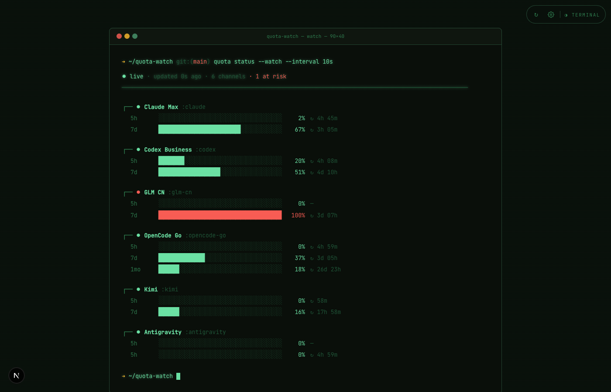
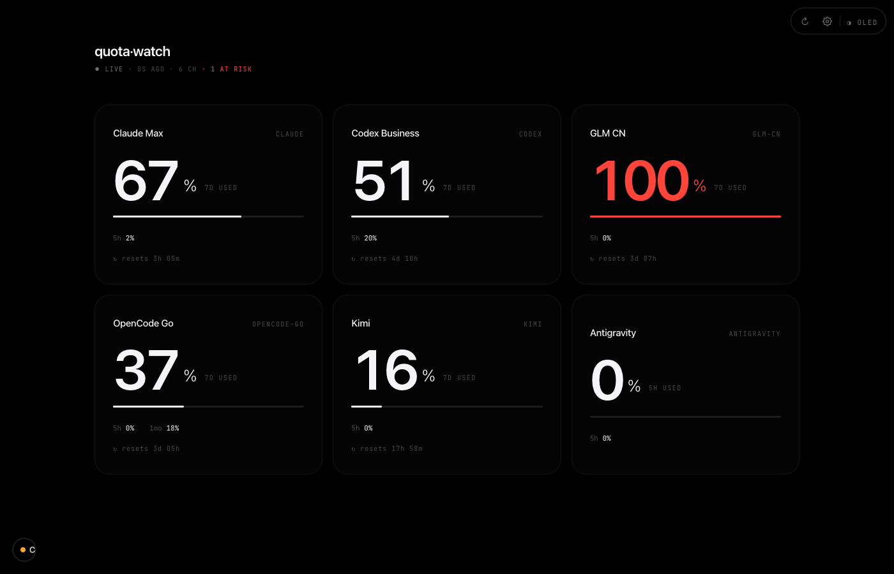
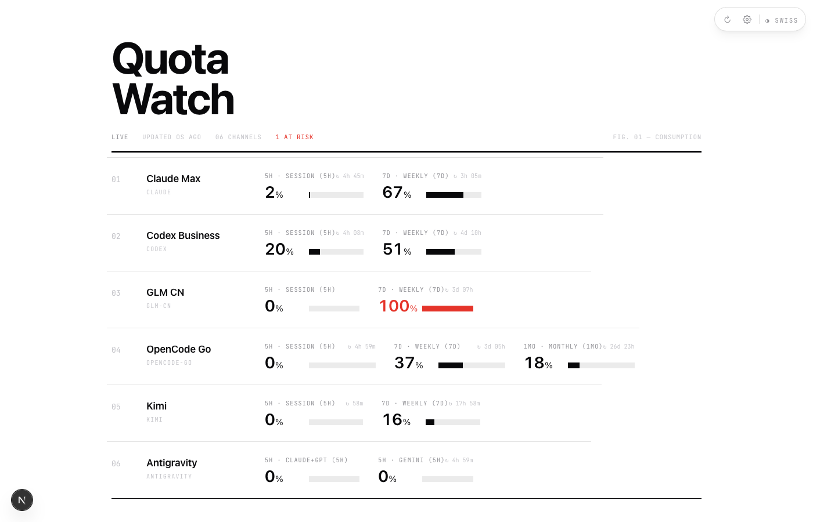
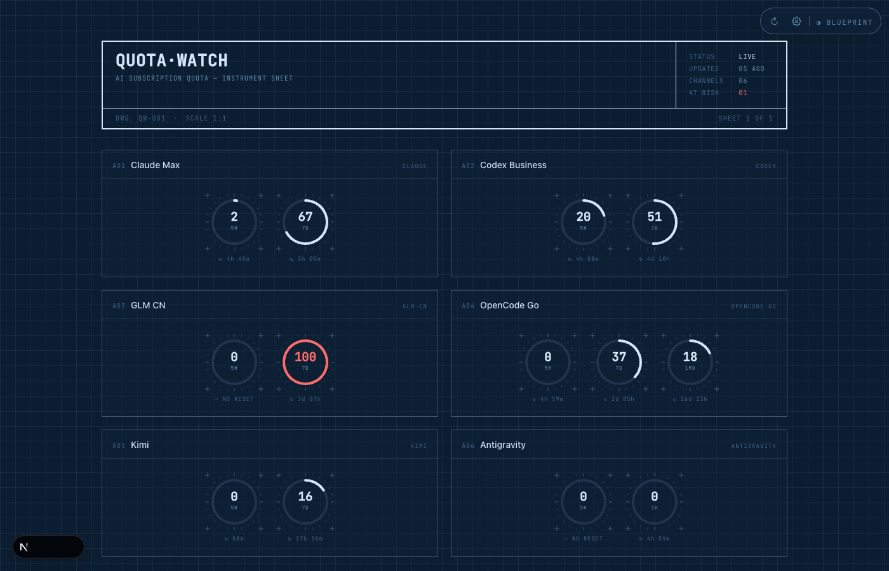

<div align="center">

# quota·watch

[English](README.md) · **简体中文**

**本地优先的 AI 订阅配额监控。**

一屏盯住 Claude Code、Codex、GLM、OpenCode Go、Kimi、Antigravity 等所有 AI 订阅
还剩多少额度、多久重置。浏览器里看,agent 经 MCP 读。
无云端、无遥测——你的凭据永远不离开本机。

[](LICENSE)




</div>

---

## 为什么

同时开着好几个 AI 编程订阅的人都懂那一刻:写到一半,某个套餐悄无声息地到顶,一切
卡住。**quota-watch** 近实时地轮询每家的真实配额接口,归一成同一个模型,在你会看的
每个地方告诉你:还剩多少、几时重置。

## 亮点

- 🛰 **7 家原生集成** —— Claude Code、Codex(即你 ChatGPT 套餐里的 Codex 额度)、GLM、OpenCode Go、Kimi、Antigravity、Grok。直连各家 HTTP 接口,不 shell-out 到社区工具。GitHub Copilot 在路线图上。
- ⚡ **近实时** —— 用量变动时约 10 秒刷新,空闲时自动降频。GLM 一超配额你几秒就看到,不是等半小时。
- 🧭 **统一模型** —— 每个配额窗口带「类型」(session · day · week · month),`5h`/`7d`/`1mo` 在每个端都按同一顺序呈现。
- 🎨 **五套网页仪表盘,五种布局** —— 不是换配色。每个主题是独立的排版、可视化与动效(见下)。
- 🤖 **MCP Server** —— agent 经 stdio 或 HTTPS 查询配额状态、拿按余量排序的派单建议。
- 🔒 **本地优先、隐私** —— SQLite 存本机;凭据只用于调各家自己的接口,从不上传任何地方。

## 网页仪表盘 —— 一个产品,五种性格

每个主题都是**不同的仪表盘**,不是换调色板。从右上角固定的控制坞实时切换。

<table>
  <tr>
    <td width="50%"><b>Magazine</b> —— 编辑印刷风<br/></td>
    <td width="50%"><b>Terminal</b> —— btop 风 CLI、ASCII 量表、CRT 扫描线<br/></td>
  </tr>
  <tr>
    <td width="50%"><b>OLED</b> —— 纯黑、超大数字<br/></td>
    <td width="50%"><b>Swiss</b> —— 国际主义排版网格<br/></td>
  </tr>
  <tr>
    <td colspan="2"><b>Blueprint</b> —— 工程蓝图 + SVG 仪表<br/></td>
  </tr>
</table>

## 快速上手

```bash
pnpm install
pnpm build

# 1. 连接渠道(网页 setup 页,支持凭据自动识别):
cd packages/web && npx next start -p 3000   # 打开 http://localhost:3000/setup
#    也可用 CLI:
node packages/cli/dist/index.js config add claude

# 2. 启动采集 daemon(内嵌 API 在 127.0.0.1:3737)
node packages/cli/dist/index.js daemon start

# 3. 开始盯
open http://localhost:3000
```

## 命令

| 命令 | 说明 |
|---|---|
| `quota-watch status [--json]` | 快速概览 |
| `quota-watch dashboard` | 交互式 TUI |
| `quota-watch config add/list/test/remove <provider>` | 管理渠道 |
| `quota-watch daemon start [--lan]` | 后台采集 + API(`--lan` 绑 `0.0.0.0` + token 认证,供局域网/隧道访问) |
| `quota-watch mcp` | 以 stdio 运行 MCP Server —— 让 agent 宿主读取额度状态 |

## MCP(面向 agent 派单)

`quota-watch mcp` 以 stdio 提供两个 MCP 工具:

| 工具 | 回答什么 |
|---|---|
| `get_quota_overview` | 全部渠道:窗口、剩余 %、重置时间、燃烧预测、上次轮询新鲜度 |
| `recommend_channel` | 按可派单余量排序的渠道清单(感知数据陈旧与报错) |

接入宿主示例(Claude Code):

```bash
claude mcp add quota-watch -- node "$PWD/packages/cli/dist/index.js" mcp
```

**远程机器**用同一组工具走 streamable HTTP:daemon 的
HTTPS API 同时把 MCP 挂在 `/mcp`,同一 Bearer token 鉴权——经 frp 隧道任何服务器都能
连。TLS 证书默认只有 127.0.0.1 的 SAN;要加入隧道公网 IP,在首次生成证书前给 daemon
环境设 `QUOTA_WATCH_CERT_EXTRA_SANS="IP:<公网IP>"`(macOS launchd 模板已内置),
删掉 `~/.quota-watch/certs/server.{crt,key}` 后重启。CA 与各设备的 pin 不受影响。
远程机器上:

```bash
mkdir -p ~/.quota-watch && scp mac:~/.quota-watch/certs/ca.crt ~/.quota-watch/
echo 'export NODE_EXTRA_CA_CERTS="$HOME/.quota-watch/ca.crt"' >> ~/.shell_env
claude mcp add quota-watch --transport http https://<公网IP>:3737/mcp \
  --header "Authorization: Bearer <~/.quota-watch/config.json 里的 api token>"
```

## 支持的渠道

| 渠道 | 窗口 | 凭据 |
|---|---|---|
| Claude Code | 5h session、7d weekly(+sonnet) | 复用 `~/.claude/.credentials.json`,自动刷新 |
| Codex | 5h session、7d weekly | 复用 `~/.codex/auth.json` —— 即你的 **ChatGPT** 登录;显示的是 ChatGPT 套餐(Plus/Pro)里的 Codex 额度,自动刷新 |
| GLM-CN | 5h session、7d weekly | Coding Plan API key |
| OpenCode Go | 5h session、7d weekly、1mo monthly | opencode.ai `auth` cookie + workspace id |
| Kimi | 5h session、7d weekly | Kimi Code API key |
| Antigravity | 5h + weekly Gemini 池、5h + weekly Claude+GPT 池 | 优先读本地运行中 IDE 的 language server(Connect RPC,免凭证),走 `RetrieveUserQuotaSummary`——与 IDE 自己的配额界面同源;IDE 未开时回退 `antigravity-usage` CLI 的 token 存储(只有 5h) |
| Grok | 月度 credits | 复用 `grok login` / cliproxyapi 共享的 xAI OAuth 存储(`~/.cli-proxy-api/xai-*.json`),自动刷新 |

*路线图:* **GitHub Copilot** 适配器(月度请求额度)已实现,但凭据接入尚未接进 app。

OpenCode Go 窗口语义(服务端定义):5h 是真滚动窗口;**weekly 周一 00:00 UTC 重置**;
**monthly 按你的账单周期时间戳重置**,不是自然月。

## 架构

```
quota-watch/
├── packages/core/    统一配额模型(窗口 kind)+ providers + 调度器
│                     + 告警器 + daemon HTTP API + CLI 凭据复用/刷新
├── packages/cli/     status · config · dashboard · daemon · mcp(stdio server)
├── packages/web/     Next.js 仪表盘 —— 五套按主题的布局,:3000
└── deploy/mac/       launchd agent:daemon + web(+ 可选 frp 隧道)
```

daemon 是中枢:轮询各家、把快照存进 SQLite、对外提供一个 HTTPS API(`/health`、
`/quota`、`/poll`、`/mcp`)。网页仪表盘与 MCP 客户端都是它的视图。

## 配置

`~/.quota-watch/config.json`(按需创建):

```json
{
  "poll": { "fastMs": 10000, "baseMs": 15000, "idleMs": 60000 },
  "api":  { "host": "127.0.0.1", "port": 3737, "token": null }
}
```

daemon API 对回环客户端免认证;非回环(局域网/公网)客户端需带
`Authorization: Bearer <api.token>`,由 `daemon start --lan` 自动生成。

## 隐私

- **Claude / Codex / Antigravity** 复用官方 CLI 已在磁盘上存好的 token —— 无需粘贴,就地刷新。
- 你提供的凭据(GLM / Kimi / OpenCode Go)只写进本机 `~/.quota-watch/data.db`(权限 600)。
- 凭据只留在本地,只用于调各家自己的配额接口,从不上传。网页只收到凭据的**字段名**。

## 许可

[MIT](LICENSE)
